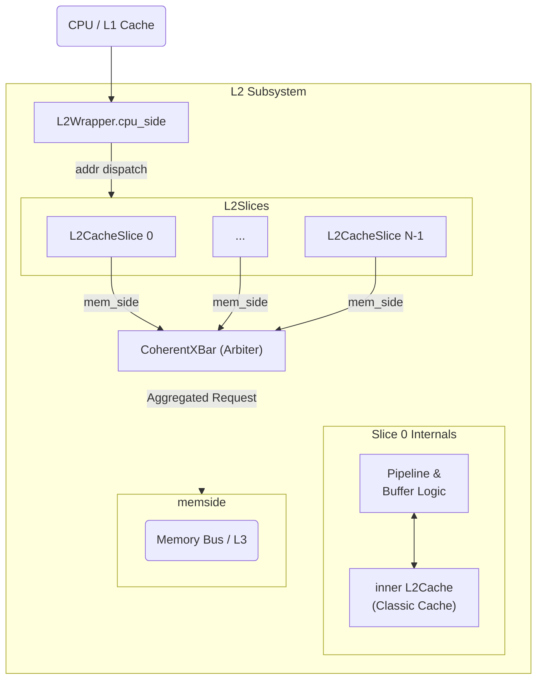
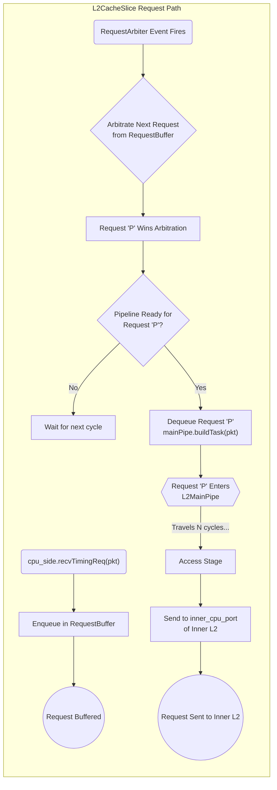
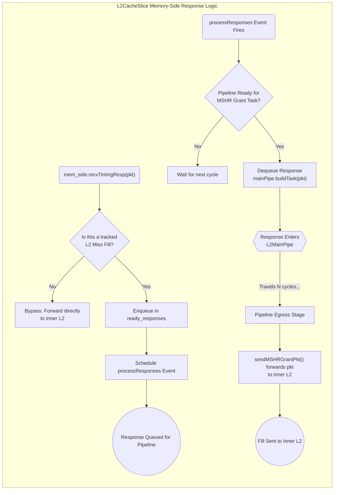
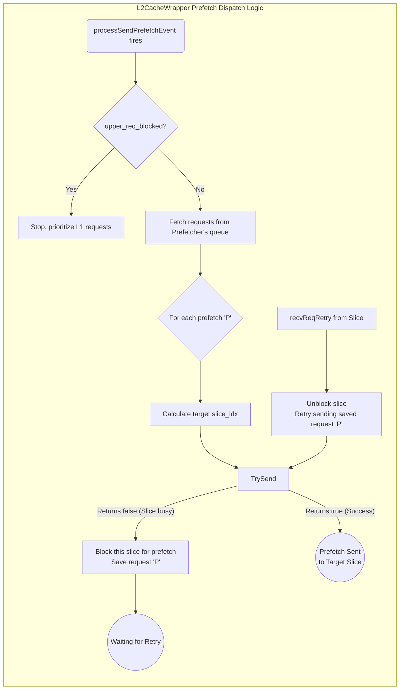
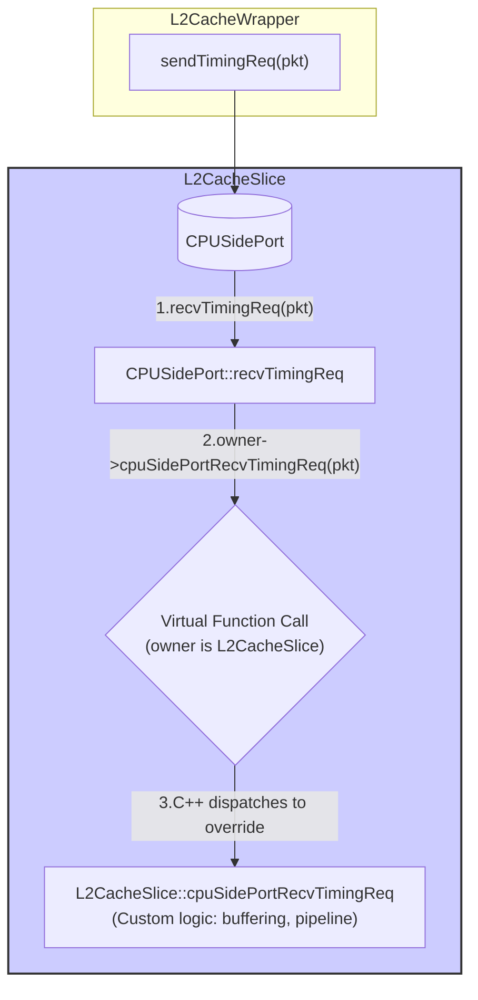
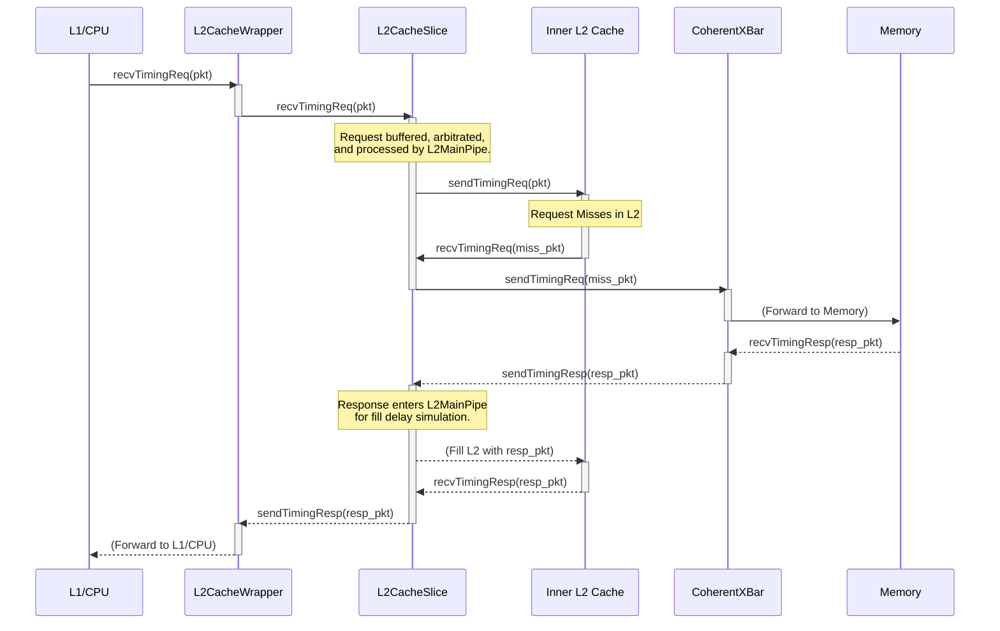
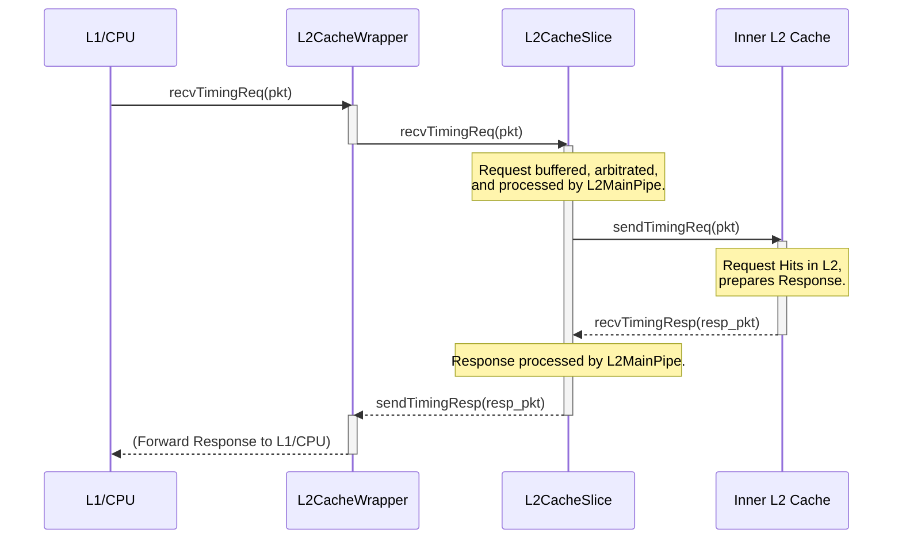
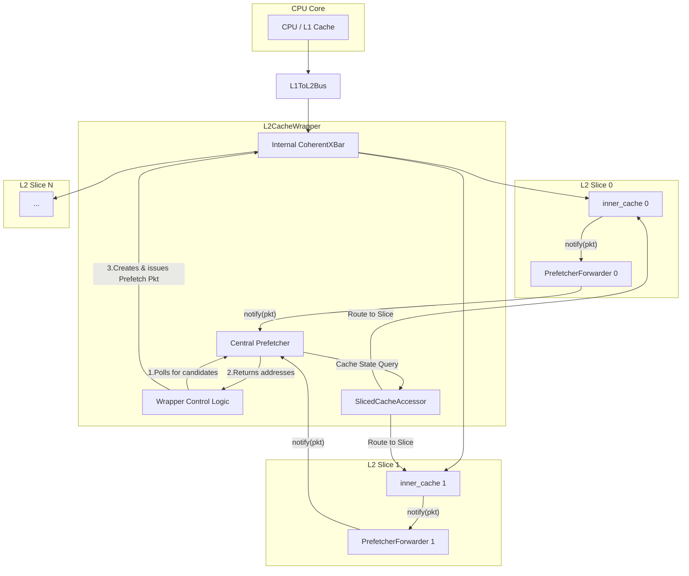
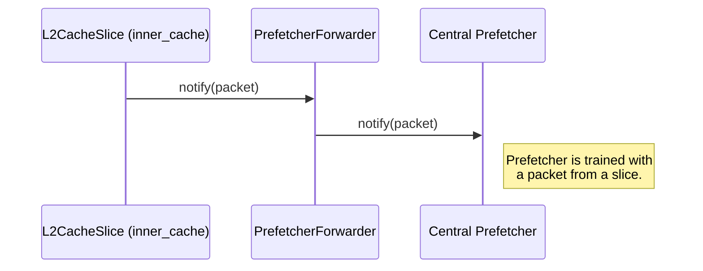
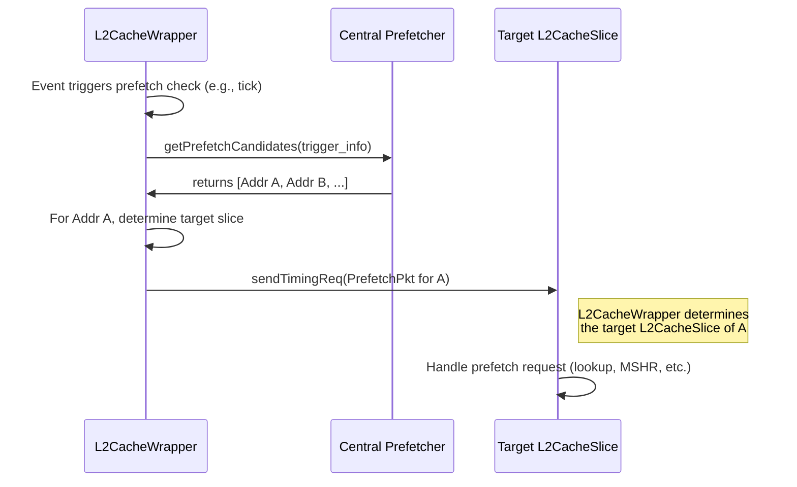

# L2 子系统架构与实现文档

## 1. 最终架构：基于分发器和内部总线的 L2 子系统

经过迭代，我们最终确定了一个三层、职责分明的L2缓存子系统架构。该系统由一个顶层的`L2CacheWrapper`、多个`L2CacheSlice`以及一个内部的`CoherentXBar`组成。`L2CacheWrapper` 演变为一个请求分发器，而核心的流水线和缓冲逻辑被移入`L2CacheSlice`。

### 1.1 核心组件职责

1.  **`L2CacheWrapper` (顶层路由器)**
    *   **角色**: 纯粹的请求分发器 (Request Router/Dispatcher)。
    *   **职责**:
        *   作为整个L2子系统的唯一入口，接收来自L1/CPU的请求。
        *   根据请求地址进行哈希计算，判断该请求应被路由到哪一个`L2CacheSlice`。
        *   将请求从`cpu_side`端口转发到对应的`slice_cpuside_ports`向量端口之一。
        *   处理和分发**预取请求**到各个 Slice。

2.  **`L2CacheSlice` (微架构模拟单元)**
    *   **角色**: `L2CacheSlice` 是 L2 子系统的核心，负责模拟单个 L2 缓存切片的完整功能和时序。
    *   **职责**:
        *   包含一个`L2Cache`的实际物理实例(`inner_cache`)，用于数据存储。
        *   实现该切片内部的自定义硬件逻辑，如请求缓冲(`RequestBuffer`)、请求仲裁(`RequestArbiter`)、流水线延迟模型(`L2MainPipe`)等。
        *   其`cpu_side`接收来自`L2CacheWrapper`的请求，`mem_side`则将所有缓存未命中(Miss)和需要访问总线的请求发送出去。

3.  **内部 `CoherentXBar` (仲裁与聚合总线)**
    *   **角色**: L2子系统内部的内存总线，是所有slices通往下一级内存的出口。
    *   **职责**:
        *   **仲裁**: 当多个`L2CacheSlice`同时发生Miss并请求内存时，它负责进行公平仲裁。
        *   **聚合**: 将所有slices的内存请求聚合到一条通往L3/主存的物理链路上。
        *   **Snoop分发**: 自动处理来自下一级内存的Snoop请求，并将其广播给所有连接到它的`L2CacheSlice`。

### 1.2 逻辑结构与数据流

此图展示了最终的L2子系统架构。`L2CacheWrapper`作为一个容器，在Python配置层面实例化并连接其内部的所有组件，包括多个Slice以及内部的XBar。

### 1.3 `L2CacheSlice` 请求路径内部逻辑

为了模拟 L2 缓存内部复杂的请求处理流程，`L2CacheSlice` 实现了一套包含请求缓冲、仲裁和流水线注入的机制，而不再是简单地将请求转发给内部 L2 缓存。

**核心逻辑如下：**

1.  **请求接收与缓冲**: 在 `cpuSidePortRecvTimingReq` 中收到上游请求后，除了 Snoop WriteBack 等高优先级请求被直接转发外，普通的数据请求若无法被下游处理则会被放入一个 `RequestBuffer` 中。
2.  **请求仲裁 (`RequestArbiter`)**: 一个独立的 `RequestArbiter` 组件负责检查 `RequestBuffer`。它实现了一套基于优先级的仲裁逻辑，从多个请求来源中挑选出下一个要处理的请求。
3.  **主流水线注入 (`L2MainPipe`)**:
    *   仲裁胜出的请求**不会**立即被发送到内部 L2 缓存。相反，它被封装成一个任务（Task），并被注入到一个模拟硬件执行的 `L2MainPipe` 流水线中。
    *   `L2MainPipe` 会根据任务类型（如 `DirRead`, `DataRead`）为其分配流水线资源，并模拟其在流水线中经历的延迟。
4.  **访问内部缓存**: 当任务在 `L2MainPipe` 中执行到特定阶段时，`L2CacheSlice` 才会真正向其内部的 `L2Cache` 实例发起访问（`inner_cpu_port.sendTimingReq`）。
5.  **命中/未命中处理**:
    *   如果**命中**，响应会内部 L2 Cache 返回。
    *   如果**未命中**，则由内部 L2 Cache 负责向下一级内存发起请求。

这个机制将请求处理从简单的转发，变成了一个精确建模的、基于事件和流水线的模拟过程，更能反映真实硬件的行为。

### 1.4 `L2CacheSlice` 响应路径内部逻辑

这部分逻辑负责处理从下层（L3/主存）返回的响应。它的核心是复用`L2MainPipe`，一个确定性的流水线，用于模拟响应在L2缓存内部完成数据填充（Fill）操作所需的延迟。

-   **目标**: 模拟响应在 L2 缓存内部完成数据填充操作所需的确定性流水线延迟。

-   **核心组件与机制**:
    1.  **`L2MainPipe`**: 一个独立的流水线模拟器，其内部维护一个记录各阶段资源占用的“计分板”。
    2.  **请求跟踪 (Request Tracking)**: `L2CacheSlice` 会监控所有从内部 L2 发往 `mem_side` 的未命中请求，并记录在一个 `pending_l3_requests` 列表中。
    3.  **响应拦截与入队 (Response Interception & Enqueue)**: 当 `memSidePortRecvTimingResp` 收到一个来自 L3 的响应时，`L2CacheSlice` 会查找匹配的在途请求。匹配成功后，响应包 `pkt` 被放入一个临时的 `ready_responses` 队列中，并调度 `processResponses` 事件。
    4.  **任务构建与注入流水线 (Task Building & Injection)**:
        *   `processResponses` 事件触发后，会检查 `L2MainPipe` 的资源可用性。
        *   如果资源可用，它会从 `ready_responses` 取出响应包，并调用 `mainPipe.buildTask(pkt, TaskSource::L2MSHRGrant)`，将一个“L2 MSHR Grant”任务注入到流水线中。
    5.  **流水线推进与响应发送 (Pipeline Advance & Response Sending)**:
        *   在后续的每个周期，事件会持续调用 `mainPipe.advance()` 来推进流水线。
        *   当“L2 MSHR Grant”任务到达指定阶段时，响应包最终被发送给内部 L2 缓存，完成数据填充。

这个方案通过一个确定性的、基于计分板的流水线模型，精确地模拟了响应处理的延迟，取代了原先基于随机延迟的设计，模型更加贴近硬件行为。

### 1.5 `L2CacheWrapper` 预取请求处理逻辑

除了分发来自 CPU 的普通访存请求外，`L2CacheWrapper` 还扮演着 L2 级预取器的**协调者和分发者**的角色。它自身挂载了一个预取器（如 `L2CompositeWithWorkerPrefetcher`），并负责从预取器队列中取出预取请求，然后将它们分发给正确的 `L2CacheSlice`。

整个预取分发的核心逻辑位于周期性触发的 `processSendPrefetchEvent` 事件中。

**处理流程如下：**

1.  **预取生成与获取**: Wrapper 不断检查其挂载的预取器，当预取器有新的预取请求（pfq 不为空）时，Wrapper 会将请求取出并使用 `outstanding_prefetch` 集合进行跟踪。
2.  **发送前提检查**: 在尝试发送任何预取请求之前，会检查 `upper_req_blocked` 标志。如果来自 L1 的常规请求已经被阻塞，则会暂停所有预取请求的发送，优先保证上层请求的通道。
3.  **目标 Slice 计算与仲裁**: 对每一个待处理的预取请求，Wrapper 会：
    *   根据其物理地址计算哈希，确定它应该被发送到哪一个 `L2CacheSlice`。
4.  **分发与流控制 (Retry 机制)**:
    *   仲裁胜出的请求会被尝试发送给目标 Slice (`slice_cpuside_ports[slice_idx]->sendTimingReq(pf_pkt)`)。
    *   **发送成功**: 如果 `sendTimingReq` 返回 `true`，则认为 Slice 接收了该请求。Wrapper 会继续处理下一个。
    *   **发送失败**: 如果返回 `false`，意味着目标 Slice 正忙，无法立即接收预取请求。此时，Wrapper **必须**：
        *   保存这个发送失败的预取请求。
        *   阻塞向该特定 Slice 发送**任何新**的预取请求，直到收到重试信号。
        *   等待目标 Slice 在其繁忙状态解除后，通过 `sendRetryReq()` 回调来通知 Wrapper。收到 `recvReqRetry` 后，Wrapper 才会重试发送之前被阻塞的预取请求。

这个机制确保了预取请求能够被正确地路由，同时通过背压（`upper_req_blocked`）和重试机制（`sendTimingReq` 返回 `false`）实现了复杂的流控制，防止预取流量干扰正常的访存请求或淹没 L2 Slices。

## 2. L2 子系统中 Snoop 请求的处理

这是一个至关重要的问题，直接关系到缓存一致性协议的正确性。

### 2.1 Snoop 请求的特殊性

Snoop 请求（如 `ReadSnoop`、`Invalidate`）是缓存一致性协议的基石。与常规的数据请求（`ReadReq`、`WriteReq`）不同，Snoop 请求具有以下特点：

-   **高优先级**: 系统期望 Snoop 请求能被快速处理和响应，以尽快解决一致性冲突。
-   **时序敏感**: 一致性协议依赖于 Snoop 请求在特定的时间窗口内被处理。任意增加延迟可能会破坏协议的正确性，导致竞态条件甚至死锁。

### 2.2 是否可以延迟 Snoop 请求？

**强烈建议不要在 `L2CacheSlice` 中对 Snoop 请求引入延迟。**

虽然技术上可以将收到的 Snoop 请求放入一个队列并延迟处理，但这极易破坏一致性协议的正常工作。在最终架构中，来自下层内存的 Snoop 请求由内部的 `CoherentXBar` 负责广播给所有的 `L2CacheSlice`，而 `L2CacheSlice` 应该立即将其转发给内部 L2 Cache 和上层的 L1 Cache，扮演一个**透明通道**的角色。

通过这种方式，自定义逻辑不会对一致性协议的控制路径引入非预期的延迟，从而保证了系统的正确运行。流水线模拟逻辑应该只应用于数据请求，而让 Snoop 请求“直通”过去。

## 3. 结构与调用图

### 3.1 继承与虚函数重载机制 (`L2CacheSlice`)

`L2CacheSlice` 的设计利用了C++的继承和虚函数机制。基类 `CacheWrapper` 扮演了一个通用转发器的角色，它定义了所有端口（`CPUSidePort`, `MemSidePort` 等）以及处理端口请求的核心虚函数（`virtual` function）。

`CacheWrapper` 的端口（如 `CPUSidePort`）在其 `recvTimingReq` 方法中，会调用其所有者（`owner`，即 `L2CacheSlice` 实例）的一个虚函数，例如 `cpuSidePortRecvTimingReq`。

当 `L2CacheSlice` 继承自 `CacheWrapper` 后，它就可以重写（`override`）这些虚函数。因此，当一个请求到达 `L2CacheSlice` 的 `cpu_side` 端口时，实际执行的是 `L2CacheSlice` 中重写的版本，从而注入了缓冲和流水线等自定义逻辑。这种方式将通用的端口连接与特定的功能实现解耦，大大提高了代码的灵活性和可重用性。

### 3.2 CPU 访存请求时序图 (L2 Miss)

此时序图详细描述了一个从 CPU 发出的读请求，在 L2 子系统中未命中，最终从主存获取数据并返回响应的完整调用链。

### 3.3 CPU 访存请求时序图 (L2 Hit)

此图描述了当一个 CPU 请求在内部 L2 缓存中**命中**时的调用流程。

## 4. L2 Cache 中央预取器设计方案

### 4.1 目标 (Goal)

在现有的 Sliced L2 Cache 架构下，将预取器（Prefetcher）逻辑从各个独立的 L2 Cache Slice 中抽离出来，集中到 `L2CacheWrapper` 中进行统一管理。

此设计旨在达到以下目的：
- **全局视野**：让预取器能够观察到所有 slices 的访问流，从而做出更精准的预取决策。
- **资源统一**：避免在每个 slice 中都实例化一个完整的预取器，节省仿真开销。
- **最小修改**：在不大量修改 gem5 核心组件（如 `BaseCache`）和现有预取器算法的前提下完成目标。
- **向前兼容**：可以通过配置脚本选择性地开启或关闭此功能。

### 4.2 核心设计思想 (Core Design Philosophy)

我们采用"**通知转发 + 接口聚合**"的策略。

- **通知转发 (Notification Forwarding)**：在每个 `L2CacheSlice` 的 `inner_cache` 中，用一个轻量级的`PrefetcherForwarder` 替代原有的预取器。此 Forwarder 的唯一职责就是将来自 `inner_cache` 的训练通知（如 `notify()` 调用）转发给 `L2CacheWrapper` 中的中央预取器。
- **接口聚合 (Interface Aggregation)**：预取器需要一个 `CacheAccessor` 接口来查询其服务的 Cache 的状态（如 `inCache()`, `inMissQueue()`）。由于中央预取器服务于多个 slices，我们将创建一个 `SlicedCacheAccessor`，它同样实现 `CacheAccessor` 接口，但内部会将查询根据地址路由到正确的 slice。

通过这种方式，中央预取器本身不需要知道多 slice 架构的存在，它可以和任何一个标准的 `CacheAccessor` 对话，从而实现了对现有预取器算法的复用。

### 4.3 关键组件设计 (Key Component Design)

#### a. `L2CacheWrapper`
- 增加一个 `prefetcher` 参数，用于实例化中央预取器。
- 增加轮询逻辑，用于在适当时机（如周期性事件）调用中央预取器的接口来获取预取地址。
- 负责根据预取器返回的地址生成预取请求包（Prefetch Packets），并发送到内部相应的 `slice`。
- 内部持有一个 `SlicedCacheAccessor` 的实例。
- 在初始化阶段，收集所有 `inner_cache` 的 `CacheAccessor` 指针，用于初始化 `SlicedCacheAccessor`。

#### b. `PrefetcherForwarder` (新组件)
- 继承自 `BasePrefetcher`。
- 内部包含一个指向真实中央预取器的指针 (`real_pf`)，通过 Python 配置进行连接。
- **实现 `notify()` 和 `probeNotify()`**：将调用直接转发给 `real_pf`。
- **重写 `hasPendingPacket()`和`getPacket()` 等请求查询发送函数**：实现为空，切断其在 slice 内部发起请求的能力。

#### c. `SlicedCacheAccessor` (新组件)
- 继承自 `CacheAccessor`。
- 内部持有一个 `L2CacheWrapper` 的指针，或者直接持有所有 `inner_cache` 的 `CacheAccessor` 指针列表。
- **实现所有虚函数**：
    - `inCache(addr, is_secure)`: 根据 `addr` 计算 `slice_id`，然后调用 `slices[slice_id]->inCache(addr, is_secure)`。
    - `inMissQueue(addr, is_secure)`: 逻辑同上。
    - `level()`: 直接返回 L2 的层级号。
    - 其他函数实现逻辑类似。

### 4.4 架构示意图 (Architecture Diagram)

### 4.5 交互流程 (Interaction Flow)

#### a. 训练流程 (Training Flow)

#### b. 预取请求流程 (Prefetch Issuing Flow)
