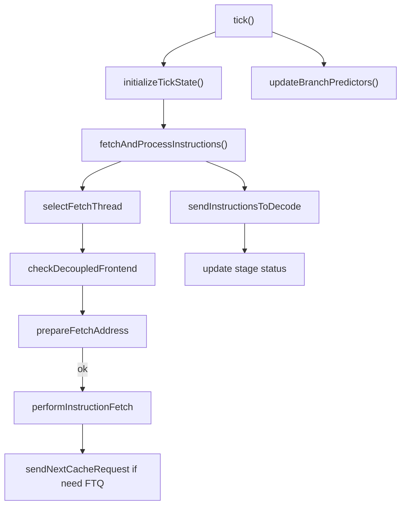
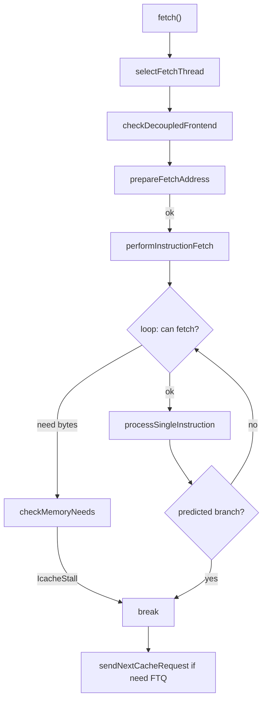
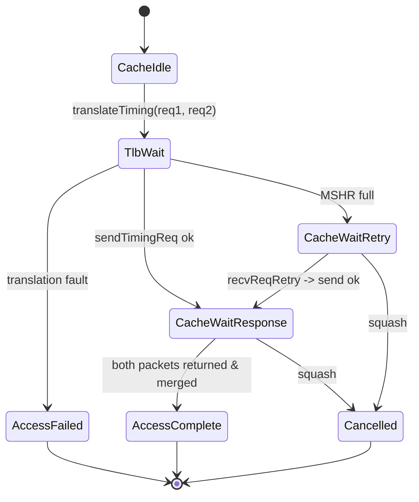
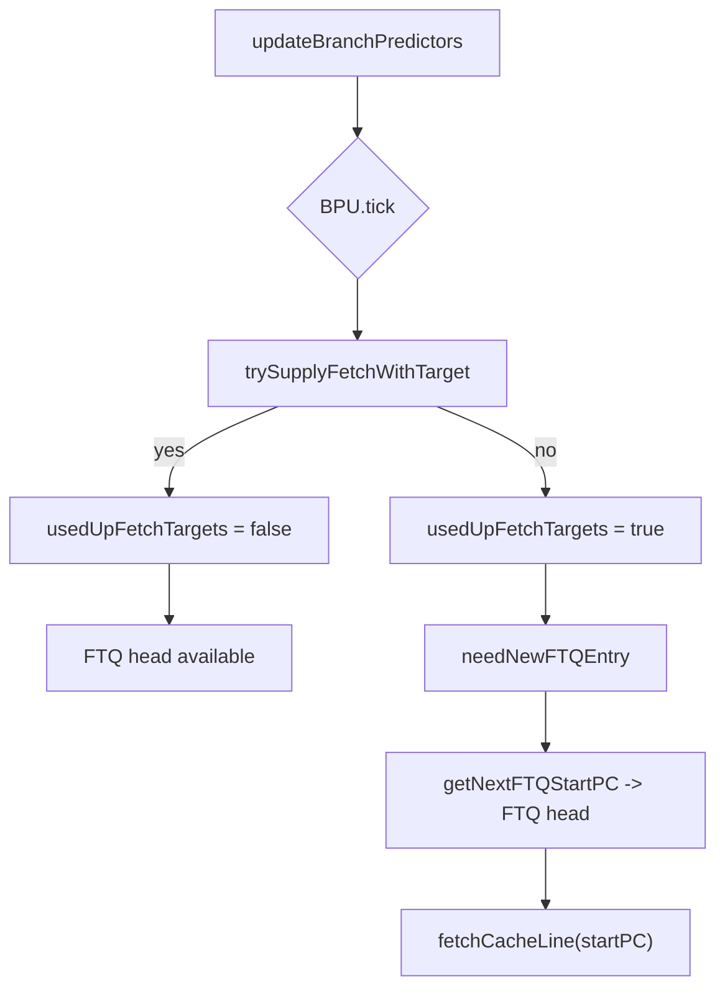
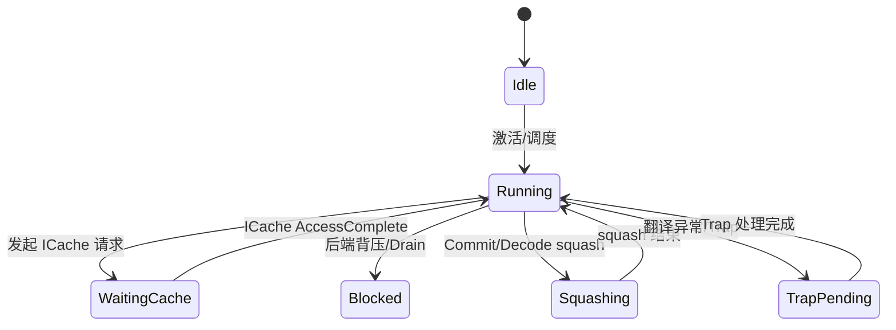

# 香山 gem5 前端取指与解耦 BPU 交互梳理

本文聚焦 O3 前端取指实现的核心逻辑、状态机、关键数据结构与 BPU（解耦式）交互，基于仓库当前实现逐行分析，避免想当然。重点文件：
- 取指：src/cpu/o3/fetch.hh:1、src/cpu/o3/fetch.cc:1
- 解耦 BPU（FTB）：src/cpu/pred/ftb/decoupled_bpred.hh:1
- 解耦 BPU（BTB）：src/cpu/pred/btb/decoupled_bpred.hh:1
- 解耦 BPU（Stream）：src/cpu/pred/stream/decoupled_bpred.hh:1

注意：本文所有行号为文件起始行号标注，不是范围。

## 总览

- O3 前端使用“解耦式前端 + FTQ/FSQ”机制；取指阶段从 ICache 以“双 cache line”形式抓取到 FetchBuffer（默认 66B），解码后构造 DynInst 放入 per-thread fetchQueue，随后按 decodeWidth 送往 Decode。
- 分支预测支持两路：传统紧耦合 BPredUnit 和解耦式 DecoupledBPU（FTB/BTB/Stream）。香山路径主要在解耦式：BPU 周期性 tick 产出取指目标，Fetch 以 FTQ 供给推进取指，逐指预测并更新下一 PC。
- 状态机分为两层：线程状态（Running/Idle/Squashing/Blocked/TrapPending/WaitingCache）与 Cache 请求状态（TlbWait/CacheWaitResponse/CacheWaitRetry/AccessComplete/AccessFailed/Cancelled）。

## 关键数据结构

- FetchBuffer：每线程取指缓冲（地址+有效位+数据+大小）
  - 定义位置：src/cpu/o3/fetch.hh:672
  - 成员意义：`startPC` 表示缓冲起始PC；`valid` 标记有效；`data` 为字节数据；`size` 默认 66B
  - 使用点：ICache 回包后 merge 两个分片，写入 `fetchBuffer[tid]` 并置 valid=true（src/cpu/o3/fetch.cc:520）
- CacheRequest：统一管理一次“可能跨多 cache line”的取指请求
  - 定义位置：src/cpu/o3/fetch.hh:816
  - 维护向量：`requests`、`packets`、`requestStatus`，以及计数 `completedPackets`
  - 总体状态聚合：`getOverallStatus()`（src/cpu/o3/fetch.hh:822）
- 线程状态与取指状态
  - ThreadStatus：Running/Idle/Squashing/Blocked/TrapPending/WaitingCache（src/cpu/o3/fetch.hh:176）
  - CacheRequestStatus：CacheIdle/TlbWait/CacheWaitResponse/CacheWaitRetry/AccessComplete/AccessFailed/Cancelled（src/cpu/o3/fetch.hh:200）
- BPU 指针（解耦）
  - 成员：`dbpftb`、`dbpbtb`、`dbsp`（src/cpu/o3/fetch.hh:560）
- 取指/解码队列
  - `fetchQueue[tid]`：per-thread 队列，避免 HoL 阻塞（src/cpu/o3/fetch.hh:906）
  - `stallReason`：按宽度统计本周期 stall 原因（src/cpu/o3/fetch.hh:948）

## 主流程（tick → initialize → fetch → update BPU）

- 入口：tick（src/cpu/o3/fetch.cc:1168）
  - 初始化：initializeTickState（src/cpu/o3/fetch.cc:1184）
    - 处理 Decode 阻塞/解阻、Commit/Decode squash、Trap 等信号；状态更新由 checkSignalsAndUpdate 完成（src/cpu/o3/fetch.cc:1430）
  - 取指与投递：fetchAndProcessInstructions（src/cpu/o3/fetch.cc:1212）
    - 循环调用 fetch（最多 numFetchingThreads 次）
    - 统计分布与前端气泡、更新 stage 活跃性
    - 送往 Decode：sendInstructionsToDecode（src/cpu/o3/fetch.cc:1288）
  - BPU 时钟推进：updateBranchPredictors（src/cpu/o3/fetch.cc:1406）
    - 调用解耦 BPU 的 tick/trySupplyFetchWithTarget 更新 FTQ 供给，并更新 usedUpFetchTargets

## 单周期取指（fetch → performInstructionFetch）

- fetch（src/cpu/o3/fetch.cc:1862）
  - 选择线程：selectFetchThread（考虑 RoundRobin/IQ/LSQ 策略）
  - 解耦前端检查：checkDecoupledFrontend → 要求 FTQ 头可用（src/cpu/o3/fetch.cc:1800）
  - 地址与状态：prepareFetchAddress（src/cpu/o3/fetch.cc:1825）
    - 若上一 miss 已完成：转 Running、清除 stall
    - 若需要新的 FTQ entry：本轮末尾会发起 ICache 请求（延迟 pipeline）
- performInstructionFetch（src/cpu/o3/fetch.cc:2009）
  - while 循环（受 fetchWidth、队列容量、遇到分支、FTQ 空、vsetvl 等限制）
  - checkMemoryNeeds：若 FetchBuffer 无效或范围不够，标记 IcacheStall（src/cpu/o3/fetch.cc:1886）
  - processSingleInstruction：解码、构建 DynInst、分支预测、推进 PC（src/cpu/o3/fetch.cc:1928）
    - 解耦：lookupAndUpdateNextPC 使用 decoupledPredict，若用尽 FTQ 目标，fetchBuffer 失效（src/cpu/o3/fetch.cc:744）

## ICache 双 cache line 抓取与流水

- 发起请求：fetchCacheLine → handleMultiCacheLineFetch（src/cpu/o3/fetch.cc:821）
  - 计算两段跨线请求（RequestPtr，reqNum=1/2），状态置 TlbWait，并调用 mmu->translateTiming
  - 线程状态置 WaitingCache（src/cpu/o3/fetch.cc:322）
- 翻译回调：finishTranslation（src/cpu/o3/fetch.cc:1071）
  - 校验是否为当前请求：validateTranslationRequest（src/cpu/o3/fetch.cc:849）
  - handleSuccessfulTranslation：构造 Packet、sendTimingReq；若 MSHR 满，置 CacheWaitRetry、记录 retryPkt（src/cpu/o3/fetch.cc:871）
  - 翻译异常：handleTranslationFault → 构造 nop 携带 fault，置 TrapPending（src/cpu/o3/fetch.cc:927）
- 回包：IcachePort::recvTimingResp → processCacheCompletion（src/cpu/o3/fetch.cc:2546）
  - processMultiCacheLineCompletion：匹配 req，累计两个分片；全部到齐后 memcpy 合并→FetchBuffer.valid=true（src/cpu/o3/fetch.cc:520）
  - 对齐校验：取指起始 PC 必须与 FTQ entry startPC 对齐（FTB/BTB）（src/cpu/o3/fetch.cc:590）
  - 线程状态：WaitingCache → Running

## 解耦前端与 BPU/FTQ 交互

- usedUpFetchTargets：当一个 FTQ 目标被用尽（比如遇到控制流边界）会置位并使 FetchBuffer 失效（src/cpu/o3/fetch.cc:756、774、761、776)
- 周期推进：updateBranchPredictors（src/cpu/o3/fetch.cc:1406）
  - Stream/FTB/BTB：tick() 后尝试 trySupplyFetchWithTarget，失败则 usedUpFetchTargets=true
  - 注：当前实现用 pc[0] 作为 trySupply 的参数（多线程时存在潜在问题，见改进建议）
- 取新 FTQ entry：
  - needNewFTQEntry：若 usedUp 或 FetchBuffer 无效则需要新 FTQ（src/cpu/o3/fetch.cc:2269）
  - getNextFTQStartPC：若 usedUp=true，优先尝试让 BPU 立刻供给下一个 FTQ head；成功则清 usedUp（src/cpu/o3/fetch.cc:2290）
  - sendNextCacheRequest：取 FTQ entry 的 startPC 发起 ICache 请求（src/cpu/o3/fetch.cc:2080）
- 分支预测（逐指）：
  - lookupAndUpdateNextPC：解耦路径调用 decoupledPredict，返回（predict_taken, usedUpFetchTargets），并在必要时失效 FetchBuffer，更新 loop iteration（FTB/BTB）（src/cpu/o3/fetch.cc:744）
- 提交与回退：
  - Commit/Decode squash → 调用解耦 BPU 的 controlSquash/trapSquash/nonControlSquash，并清理 Fetch 状态与 cache 请求（src/cpu/o3/fetch.cc:1460，1510 等）

## 与后端交互

- 向 Decode 发射：sendInstructionsToDecode（src/cpu/o3/fetch.cc:1288）
  - 按 decodeWidth 合并多线程 fetchQueue，统计 stall 原因和前端气泡
- 来自 Decode 的阻塞/解阻、squash：checkSignalsAndUpdate/handleDecodeSquash（src/cpu/o3/fetch.cc:1430、1565）
- 来自 Commit 的 squash、trap、正常更新：handleCommitSignals（src/cpu/o3/fetch.cc:1499）
  - 解耦路径会映射为 controlSquash/nonControlSquash/trapSquash，并更新 FSQ/FTQ

## 线程状态机（简化）

## 细节与实现要点

- 双 cache line 固化：fetchCacheLine 总是发起两段请求（66B buffer 设计，简化“跨线 + 解码尾 4B”），以 misaligned fetch 标记（src/cpu/o3/fetch.cc:844）
- 回包拼接：按 reqNum=1/2 匹配两个 packet 后再 memcpy；完成后清除 usedUpFetchTargets 并对齐校验 FTQ（src/cpu/o3/fetch.cc:520、560）
- 逐指预测：解耦 BPU 决定 next_pc 并返回 “本 FTQ 是否已用尽”的布尔，Fetch 负责在该点失效 buffer 与发起下一 FTQ 请求，让“供给与消费”解耦
- 发送时机：sendNextCacheRequest 放在 performInstructionFetch 尾部，根据 needNewFTQEntry 触发，形成轻度流水

## 潜在问题与改进建议

1) usedUpFetchTargets 为类级变量，未按线程区分
- 现状：在 updateBranchPredictors 中用 `pc[0]` 推进并覆盖全局 `usedUpFetchTargets`（src/cpu/o3/fetch.cc:1412/1421/1425）
- 风险：SMT 多线程时，线程间相互干扰；FTQ/FetchBuffer 语义本应 per-thread
- 建议：改为 `usedUpFetchTargets[MaxThreads]` + 以 tid 粒度推进 BPU.trySupply，所有判断与失效都应按 tid 生效

2) processMultiCacheLineCompletion 对“非预期包”不释放内存
- 现状：未匹配到当前请求时直接 `return false`，但未 `delete pkt`（src/cpu/o3/fetch.cc:536 附近日志写着“deleting pkt”，但代码没 delete）
- 风险：内存泄漏；同时违反“发起方回收 Packet”的常见约定
- 建议：未匹配时立即 `delete pkt`；同时增加统计（如 icacheSquashes）以便监控

3) 总是双线访问，带来额外带宽压力
- 现状：无条件发起两段请求（src/cpu/o3/fetch.cc:844）
- 建议：根据 `fetch_pc % 64 <= 62` 条件，优先单线；尾部不足再发起第二线；或允许多 outstanding FTQ 提前预取，结合 MSHR 能力进行节流

4) FetchBuffer 与 FTQ 关联缺少 ID 信息
- 现状：仅校验 startPC 对齐（src/cpu/o3/fetch.cc:590）
- 风险：在频繁 squash/redirect 或重入场景，单纯 PC 对齐不足以捕捉所有竞态
- 建议：为 FetchBuffer 增加 `ftq_id`（或 fsq_id）标记；finishTranslation/processCacheCompletion 校验二者一致后再接受数据

5) 提前管线化/预取机会
- 现状：sendNextCacheRequest 只在 performInstructionFetch 尾触发（src/cpu/o3/fetch.cc:2080）
- 建议：可在“遇到 predicted branch/usedUp”即时触发下一 FTQ 的 ICache 访问，进一步隐藏 miss 延迟；或在 fetch 完成前半拍预取下一流

6) vsetvl 抑制策略更细粒度
- 现状：通过 waitForVsetvl + emptyROB 清除（src/cpu/o3/fetch.cc:1206）
- 建议：结合后端 rename/IEW 压力、decode 阻塞信号，给予更细粒度门控，避免过度保守

7) 统计与可观测性
- 现状：已有 TopDown 前端气泡与 stall 分类统计（src/cpu/o3/fetch.cc:1360、1381）
- 建议：细分 FTQBubble、ICacheStall、TLBStall 的贡献与重叠；区分“无目标供给”和“目标供给但未发起访问”等子类

## 调试与验证建议

- DebugFlags：
  - Fetch、FetchVerbose、DecoupleBP、DecoupleBPProbe、FTB、LoopPredictor
  - 示例：`--debug-flags=Fetch,DecoupleBP --debug-file=fetch.trace`
- 快速运行（香山配置）：
  - `./build/RISCV/gem5.opt ./configs/example/xiangshan.py --raw-cpt --generic-rv-cpt=<path> [--ideal-kmhv3 --bp-type=DecoupledBPUWithBTB]`
- 系统测试：
  - `cd tests && ./main.py run --length quick --variant opt --isa RISCV`
- 重构/性能对比：
  - `cp build/RISCV/gem5.opt build/RISCV/gem5.opt.ref && python3 debug/run_cpt.py --debug-dir debug/opt_ref`
  - `grep 'cpu.ipc' debug/opt_ref/*/stats.txt`、`grep 'fetch.rate' ...`

## 参考定位（代码入口）

- 线程状态与 Cache 请求状态：src/cpu/o3/fetch.hh:176、src/cpu/o3/fetch.hh:200
- FetchBuffer/CacheRequest 定义：src/cpu/o3/fetch.hh:672、src/cpu/o3/fetch.hh:816
- tick / initializeTickState / fetchAndProcessInstructions：src/cpu/o3/fetch.cc:1168、src/cpu/o3/fetch.cc:1184、src/cpu/o3/fetch.cc:1212
- checkSignalsAndUpdate（含 Commit/Decode squash 路径）：src/cpu/o3/fetch.cc:1430
- updateBranchPredictors（解耦前端周期推进/供给）：src/cpu/o3/fetch.cc:1406
- fetch / performInstructionFetch / checkMemoryNeeds：src/cpu/o3/fetch.cc:1862、src/cpu/o3/fetch.cc:2009、src/cpu/o3/fetch.cc:1886
- lookupAndUpdateNextPC（逐指预测，含 usedUpFetchTargets）：src/cpu/o3/fetch.cc:744
- 取新 FTQ 条目/发起 ICache 请求：src/cpu/o3/fetch.cc:2269、src/cpu/o3/fetch.cc:2290、src/cpu/o3/fetch.cc:2080
- ICache 请求/翻译/回包：src/cpu/o3/fetch.cc:821、src/cpu/o3/fetch.cc:849、src/cpu/o3/fetch.cc:871、src/cpu/o3/fetch.cc:1071、src/cpu/o3/fetch.cc:2546
- FTB 解耦 BPU 关键接口：src/cpu/pred/ftb/decoupled_bpred.hh:540（trySupply）、src/cpu/pred/ftb/decoupled_bpred.hh:596（decoupledPredict）、src/cpu/pred/ftb/decoupled_bpred.hh:602/611/616（control/nonControl/trapSquash）、src/cpu/pred/ftb/decoupled_bpred.hh:619（update）

——

如需我进一步将文档保持与代码演进同步、或顺手提交一个小 PR 修正“未匹配回包未释放内存”和“usedUpFetchTargets per-thread 化”的问题，可继续告知。

