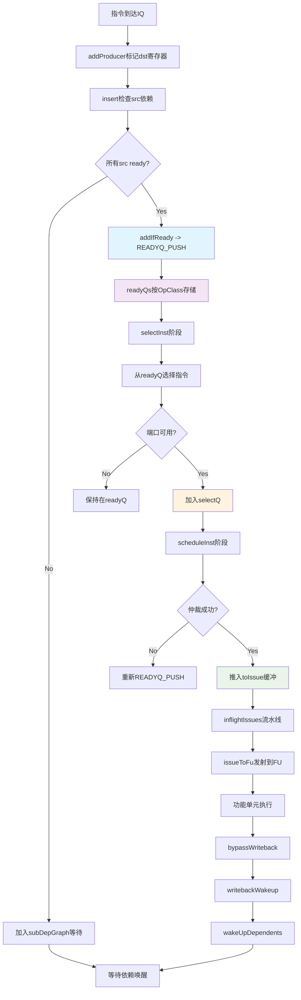
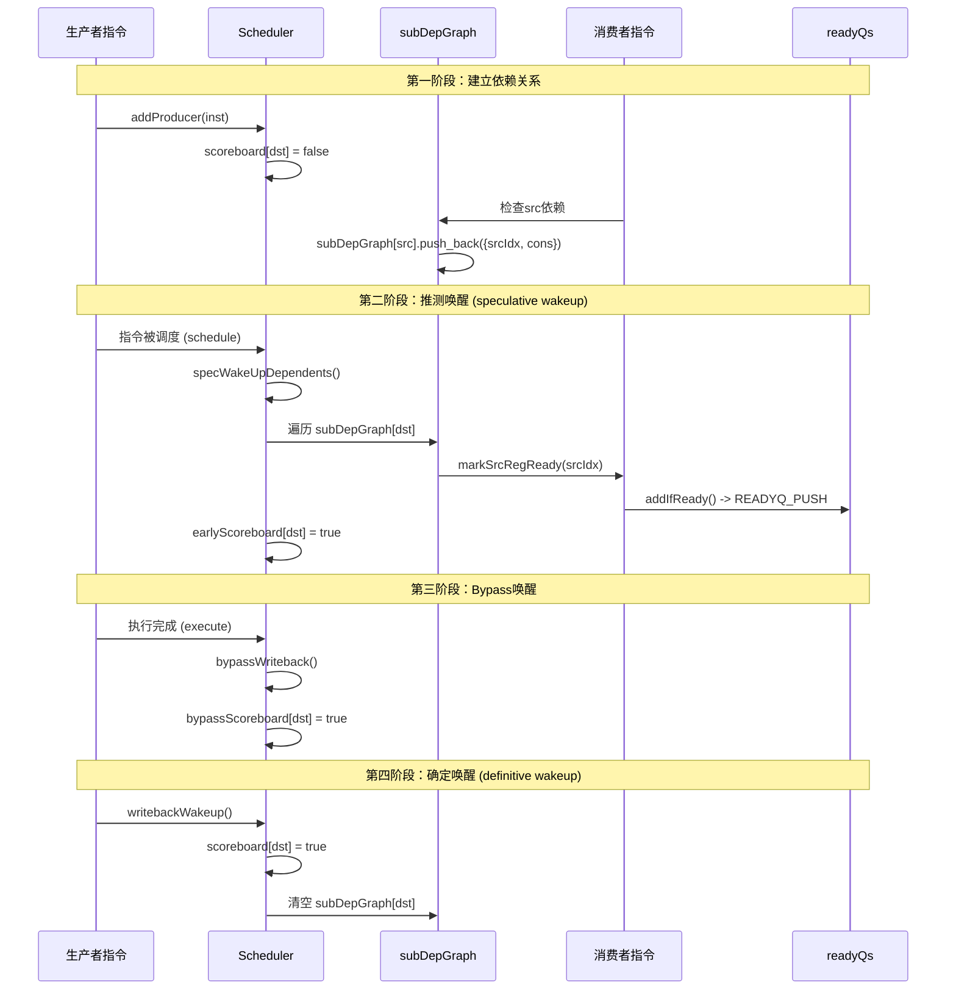
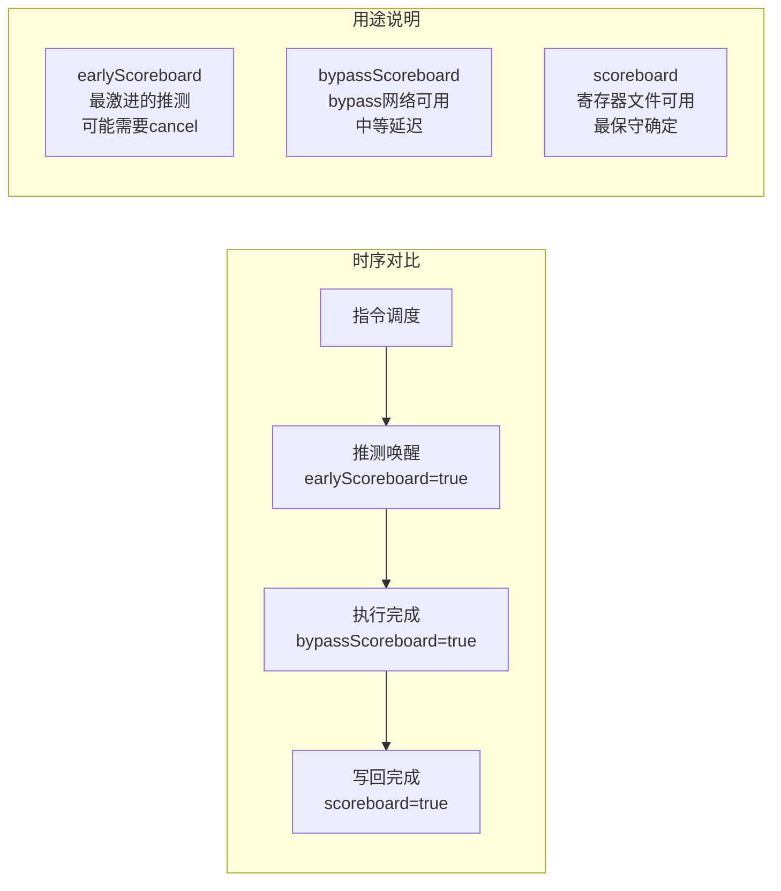

# IEW阶段调度器数据流分析

## 关键数据结构

### 1. Issue Queue (IQ) 核心数据结构
- `instList`: 所有在IQ中的指令列表
- `readyQs[port]`: 按发射端口分组的就绪指令队列
- `readyQclassify[OpClass]`: 按指令类型分类的就绪队列映射
- `selectQ`: 当前周期被选中的指令队列
- `subDepGraph[physReg]`: 依赖图，记录等待某物理寄存器的指令

### 2. Scheduler 全局数据结构
- `scoreboard[physReg]`: 确定性scoreboard，记录寄存器是否writeback完成
- `bypassScoreboard[physReg]`: bypass scoreboard，记录bypass网络中的值
- `earlyScoreboard[physReg]`: 早期scoreboard，推测唤醒使用
- `wakeMatrix[srcIQ][dstIQ]`: IQ间的唤醒拓扑矩阵

### 3. 流水线缓冲
- `inflightIssues`: 发射流水线缓冲区 (TimeBuffer)
- `toIssue`: 当前周期准备发射的指令
- `toFu`: 到达功能单元的指令

## 指令调度流水线



## 依赖唤醒机制详解



## 三种Scoreboard机制对比



## 具体Log执行时序分析

基于log中前4条指令的执行流程：

```mermaid
gantt
    title 指令调度时序图 (基于log分析)
    dateFormat X
    axisFormat %s
    
    section 指令1 (sn:1)
    插入IQ         :0, 1
    进入readyQ     :0, 1  
    被选择         :1, 2
    调度成功       :2, 3
    推测唤醒       :2, 3
    执行完成       :4, 5
    bypass写回     :4, 5
    确定写回       :4, 5
    
    section 指令4 (sn:4)  
    插入IQ         :0, 1
    等待依赖       :0, 2
    被推测唤醒     :2, 3
    进入readyQ     :2, 3
    被选择         :3, 4
    调度成功       :4, 5
```



### 关键时间点说明 (对应log)

**Cycle 123 (tick 40959)**:
```log
[sn:1] IntAlu insert into intIQ0
[sn:1] add to readyInstsQue        // 无依赖，直接进readyQ
[sn:4] src p33 add to depGraph     // 有依赖，进入subDepGraph
```

**Cycle 124 (tick 41292)**:
```log
[sn 1] was selected                // selectInst()选择指令1
[sn:1] no conflict, scheduled      // scheduleInst()调度成功
[sn:1] intIQ0 create wakeupEvent   // specWakeUpDependents()推测唤醒
[sn:4] src0 was woken             // 指令4被唤醒
```

**Cycle 125 (tick 41625)**:
```log  
[sn 4] was selected               // 指令4现在ready，被选择
IntAlu [sn:1] add to FUs          // 指令1发射到功能单元
```

**Cycle 127 (tick 42291)**:
```log
[sn:1] bypass write               // bypass阶段
p33 in bypassNetwork ready
[sn:1] was writeback              // 确定写回
```

## 关键代码位置参考

| 功能 | 文件位置 | 关键函数 |
|------|----------|----------|
| 依赖图建立 | issue_queue.cc:621-636 | `insert()` |
| 入队ready指令 | issue_queue.cc:450-475 | `addIfReady()` |
| 指令选择 | issue_queue.cc:493-538 | `selectInst()` |
| 指令调度 | issue_queue.cc:541-573 | `scheduleInst()` |
| 推测唤醒 | issue_queue.cc:1079-1116 | `specWakeUpDependents()` |
| 依赖唤醒 | issue_queue.cc:417-448 | `wakeUpDependents()` |
| 确定唤醒 | issue_queue.cc:1241-1256 | `writebackWakeup()` |

## 性能优化要点

1. **推测执行**: 通过earlyScoreboard实现激进的推测唤醒，减少调度延迟
2. **Bypass网络**: 通过bypassScoreboard支持结果前传，避免寄存器文件读写延迟  
3. **分布式调度**: 多个IssueQueue并行工作，提高发射带宽
4. **依赖图优化**: 精确的依赖追踪，避免不必要的等待
5. **端口仲裁**: 智能的端口分配策略，最大化硬件利用率
